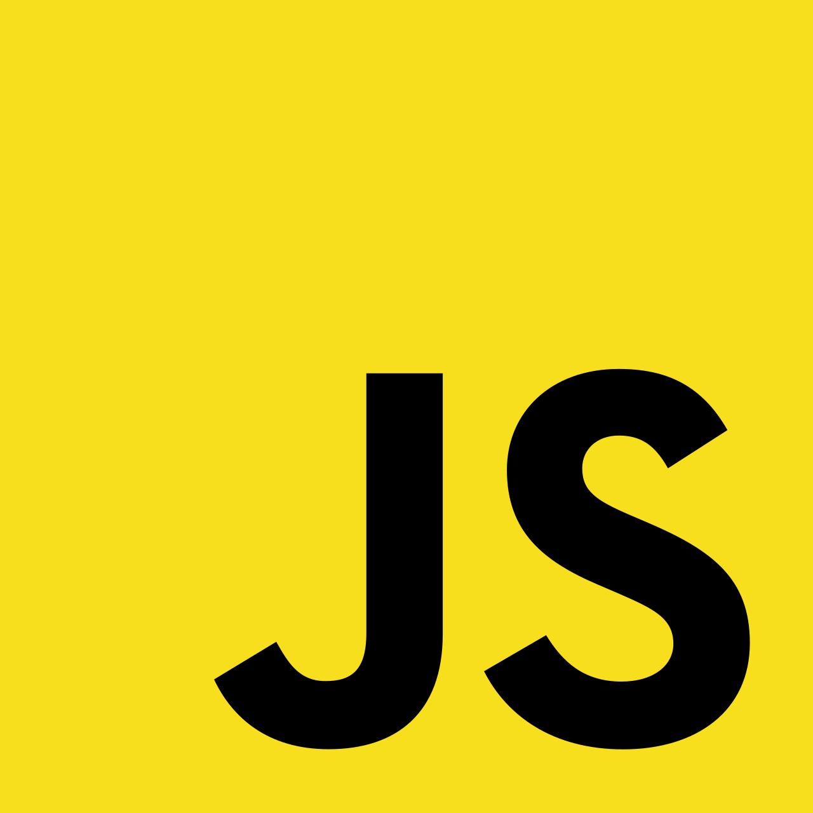

 

> 알고리즘을 공부하고, 그 내용을 기록합니다.

- [Github 주소](https://github.com/InSeong-So/Algorithm)
- [알고리즘 스터디](https://github.com/SISALGO)

 

# 개요
## 과정
#### :book: 알고리즘 이해를 위한 이론과 접근법을 독립된 디렉토리에 정리
#### :book: snippet 생성
- 마크다운 템플릿용
  - img 태그, 전체 입력 폼 등
- 자바스크립트 템플릿용
  - jest, input, solution 등의 함수
#### :book: 언어별 테스트를 위한 라이브러리를 적용
- 현재 이 게시글의 작업 환경은 Visual Studio Code를 중점적으로 사용하고 있으며 자바스크립트 테스트 프레임워크인 `jest`를 채택하고 있습니다.

 

## 명심하기!
1. 종이든 모니터든 자신에게 맞는 형태를 찾아야 하며, 어떤 방법으로든 **글을 써야** 성장합니다.
2. 100점이 목표가 아니라 100점을 맞을 수 있는 공부 방법을 찾는 것입니다.
3. 지속적으로 훈수 받아라. 빠른 피드백을 통해 늦어도 2 ~ 3일 이내에 해결합니다.
4. 기초를 이해하는 것은 **어떤 것도 생략하지 않고 백지에 A to Z를 적었을 때 누가 읽어도 이해할 수 있는 것**입니다.

 

## 이 저장소로 알고리즘 공부는 어떻게 하는가?
1. 어떤 문제가 있는지 파악하면서 신기한 문제나 새로 발견된 문제를 수집합니다.
3. 카테고리별로 문제를 **선별** 합니다. 단, 바로 풀 수 있는 문제는 절대 넣지 않습니다.
   - 예제 문제를 풀면서 다 맞았다고 착각하는 것과 똑같으며 안 되는 문제에 시간을 투자하는 것입니다.
5. 딱 봤을 때 **5초** 안에 해법이 떠오르지 않는 문제 **200여개**를 선별한 뒤, 문제의 서술 방식이 비슷한 것끼리 분류합니다.
6. **나만의 카테고리**를 만들고, 하루에 카테고리별 문제를 번갈아가면서 풉니다.
7. 풀다 보면 유형이 너무 비슷한 문제가 생기므로 200여개보다 적어질 수 있습니다. 그렇다면 문제를 보았을 때 머릿속에 해법이 떠오르면 문제를 **지웁니다**.
8. 위와 같은 행위를 일일 단위로 시행하고, 주 단위로 회고하여 기록합니다.
9. 문제 선별은 3주 내에 완료 되어야 하며, 전제는 **알고리즘 기초가 숙달된 상태**입니다. 기초라 함은 아래와 같습니다.
    - 기본적인 자료구조(linked list, stack, queue, graph 등)
    - 기본적인 알고리즘(sort, recursion, greedy 등)
10. 모든 순서를 완료해야 **나만의 200제 모의고사**가 생기고, 이를 완벽하게 이해하고 있어야만 실제 테스트에서 50% 정도의 성적을 낼 수 있습니다.
11. 이후, 다른 문제들을 풀어보면서 **모의고사**를 기반으로 변형된 내용을 이해하고 모의고사에 적용했던 유형을 분석하여 다시 정리하여야 10 ~ 20% 정도의 성적을 향상할 수 있습니다.
12. 항상 개념노트의 작성은 꼼꼼하게 잘 챙겨주고, 제출이나 디버깅 전에 미리 테스트케이스를 짜보면서 진행하세요.
13. 일련의 과정들이 무엇을 요망하는 것이냐면, **[어떤 문제를 풀든 간에 익숙해야 한다!]** 입니다.
    - **아는 문제**가 나와야 쉽게 접근하고 여러 방안을 대입할 수 있습니다. 즉, **어떤 카테고리**에 **어떤 방법**을 적용해야 하는지 암기할 정도로 이해하고 있어야 합니다.
    - **함정**과 **유효성**을 항상 신경써야 하며 이를 테스트케이스로 발전 시킬 수 있어야 합니다.

 

## 기록/공부 규칙
1. 분류한 문제는 이미지를 그대로 스캔하여 problem 디렉토리에 저장합니다.
2. 동일한 이름으로 코드 파일을 만든다(.java, .spec.js, .py 등).
3. 문제를 풀이한 정답 코드가 아닌 **pseudo code**와 **comment**, **testcase**를 기록합니다.

 

## 참조
1. [백준](https://www.acmicpc.net/)
2. [프로그래머스](https://programmers.co.kr/)
4. [리트코드](https://leetcode.com/)
5. [해커랭크](https://www.hackerrank.com/)
6. [순열, 조합 공식](https://coding-factory.tistory.com/606)
3. [인프런 김태원 지식공유자 강의](https://www.inflearn.com/course/%EC%9E%90%EB%B0%94%EC%8A%A4%ED%81%AC%EB%A6%BD%ED%8A%B8-%EC%95%8C%EA%B3%A0%EB%A6%AC%EC%A6%98-%EB%AC%B8%EC%A0%9C%ED%92%80%EC%9D%B4)