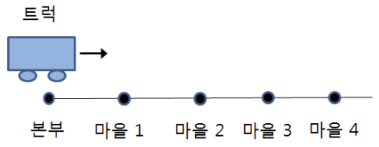
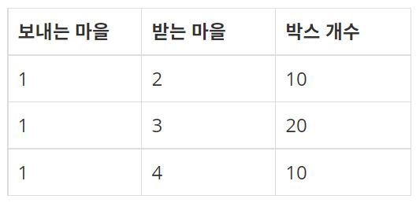
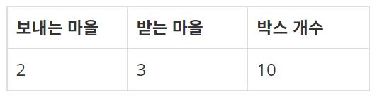
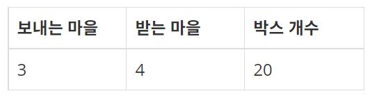
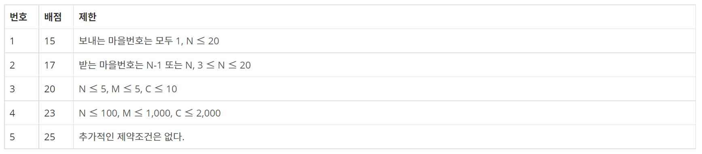

<div align='center'>


</div>

<br>

> 이 게시글은 [백준 8980번 택배](https://www.acmicpc.net/problem/8980) 문제를 풀이합니다. 언어는 *Javascript*입니다.

<br>

# 문제
아래 그림과 같이 직선 도로상에 왼쪽부터 오른쪽으로 1번부터 차례대로 번호가 붙여진 마을들이 있다. 마을에 있는 물건을 배송하기 위한 트럭 한 대가 있고, 트럭이 있는 본부는 1번 마을 왼쪽에 있다. 이 트럭은 본부에서 출발하여 1번 마을부터 마지막 마을까지 오른쪽으로 가면서 마을에 있는 물건을 배송한다.

<br>

<div align='center'>



</div>

<br>

각 마을은 배송할 물건들을 박스에 넣어 보내며, 본부에서는 박스를 보내는 마을번호, 박스를 받는 마을번호와 보낼 박스의 개수를 알고 있다. 박스들은 모두 크기가 같다. 트럭에 최대로 실을 수 있는 박스의 개수, 즉 트럭의 용량이 있다. 이 트럭 한대를 이용하여 다음의 조건을 모두 만족하면서 최대한 많은 박스들을 배송하려고 한다.

1. 조건 1: 박스를 트럭에 실으면, 이 박스는 받는 마을에서만 내린다.
2. 조건 2: 트럭은 지나온 마을로 되돌아가지 않는다.
3. 조건 3: 박스들 중 일부만 배송할 수도 있다.

마을의 개수, 트럭의 용량, 박스 정보(보내는 마을번호, 받는 마을번호, 박스 개수)가 주어질 때, 트럭 한 대로 배송할 수 있는 최대 박스 수를 구하는 프로그램을 작성하시오. 단, 받는 마을번호는 보내는 마을번호보다 항상 크다.

예를 들어, 트럭 용량이 40이고 보내는 박스들이 다음 표와 같다고 하자.

<br>

<div align='center'>


</div>

<br>

이들 박스에 대하여 다음과 같이 배송하는 방법을 고려해 보자.

(1) 1번 마을에 도착하면
- 다음과 같이 박스들을 트럭에 싣는다. (1번 마을에서 4번 마을로 보내는 박스는 30개 중 10개를 싣는다.)

<br>

<div align='center'>



</div>

<br>

(2) 2번 마을에 도착하면
- 트럭에 실려진 박스들 중 받는 마을번호가 2인 박스 10개를 내려 배송한다. (이때 트럭에 남아있는 박스는 30개가 된다.)
- 그리고 다음과 같이 박스들을 싣는다. (이때 트럭에 실려 있는 박스는 40개가 된다.)

<br>

<div align='center'>



</div>

<br>

(3) 3번 마을에 도착하면 
- 트럭에 실려진 박스들 중 받는 마을번호가 3인 박스 30개를 내려 배송한다. (이때 트럭에 남아있는 박스는 10개가 된다.)
- 그리고 다음과 같이 박스들을 싣는다. (이때 트럭에 실려 있는 박스는 30개가 된다.)

<br>

<div align='center'>



</div>

<br>

(4) 4번 마을에 도착하면 
- 받는 마을번호가 4인 박스 30개를 내려 배송한다.

위와 같이 배송하면 배송한 전체 박스는 70개이다. 이는 배송할 수 있는 최대 박스 개수이다.

<br>

# 입력
> 입력의 첫 줄은 마을 수 N과 트럭의 용량 C가 빈칸을 사이에 두고 주어진다. N은 2이상 2,000이하 정수이고, C는 1이상 10,000이하 정수이다. 다음 줄에, 보내는 박스 정보의 개수 M이 주어진다. M은 1이상 10,000이하 정수이다. 다음 M개의 각 줄에 박스를 보내는 마을번호, 박스를 받는 마을번호, 보내는 박스 개수(1이상 10,000이하 정수)를 나타내는 양의 정수가 빈칸을 사이에 두고 주어진다. 박스를 받는 마을번호는 보내는 마을번호보다 크다. 

## 예제 입력 1

```
4 40
6
3 4 20
1 2 10
1 3 20
1 4 30
2 3 10
2 4 20
```

## 예제 입력 2

```
6 60
5
1 2 30
2 5 70
5 6 60
3 4 40
1 6 40
```

<br>

# 출력
> 트럭 한 대로 배송할 수 있는 최대 박스 수를 한 줄에 출력한다.

## 예제 출력 1

```
70
```

## 예제 출력 2

```
150
```

<br>

# 서브태스크

<br>

<div align='center'>



</div>

<br>

# 풀이
## 접근
저는 맨 처음 시작 마을 순서대로 정렬했는데, 이렇게 접근하면 틀립니다. 만약 아래와 같은 형태로 마을이 주어진다면 어떨까요?

```
6 60
5
1 2 30
2 5 70
5 6 60
3 4 40
1 6 40
```

마을 순서대로 정렬했으니, `1 2`에 해당하는 **30**과 `1 6`에 해당하는 **40**을 트럭에 싣게 되므로 끝날 떄까지 택배 용량이 **30**으로 유지되겠죠? 중간에 더 많이 옮길 수 있는데도 모래 주머니가 생기는 셈입니다.

자, 순서대로 생각해봅시다.

1. 시작 지점(`s`)에서 택배를 받아 도착 지점(`e`)에 택배를 내려놓는다고 하면, s부터 e-1까지 택배를 들고 있어야 합니다.
2. s부터 e까지 여유 용량 K에서 택배의 용량(`w`)만큼을 뺀 것으로 계산합니다.
3. s = 2, e = 4, w = 20일 때면 아래와 같습니다.
  ```
  1   2   3   4   5   6
  40  20  20  40  40  40
  ```
4. 다음 `1 - 4구간`에서 택배 용량이 30이라면 `2 - 3구간`의 여유 용량이 20이므로 **20**만큼만 옮길 수 있습니다.

어떻게 가능할까요? 이게 가능한 이유는 시작 지점이 아닌 `도착 지점`을 기준으로 정렬했기 때문입니다.

도착 지점이 1과 가까울 수록 택배를 더 많이 나를 수 있게 되는 것이죠.

<br>

## 알고리즘(의사 코드)
```
@input
N, W, arr

@variable
truck

answer = 0
for node to arr
  min_weight = W
  s, e, w = node
  for s to e
    min_weight = min(min_weight, truck[s])
  min_weight = min(min_weight, w)
  for s to e
    truck[s] -= min_weight
  
  answer += min_weight
```

<br>

## 구현
```js
const solution = input => {
  const [N, W] = input[0].split(' ').map(e => +e);
  const village = input
    .slice(2)
    .map(e => e.split(' ').map(e2 => +e2))
    .sort((a, b) => a[1] - b[1] || a[0] - b[0]);

  const truck = Array(N + 1).fill(W);

  let answer = 0;
  for (let v of village) {
    let min = W;
    const [start, end, weight] = v;
    for (let i = start; i < end; i++) {
      min = min > truck[i] ? truck[i] : min;
    }
    min = min > weight ? weight : min;
    for (let i = start; i < end; i++) {
      truck[i] -= min;
    }

    answer += min;
  }

  console.log(answer);
};

/* 테스트 케이스 정의 */
describe('8980', () => {
  // 변수 입력하기
  const input =
    process.platform === 'linux'
      ? require('fs')
          .readFileSync('/dev/stdin')
          .toString()
          .trim()
          .split(require('os').EOL)
      : [
          '4 40',
          '6',
          '3 4 20',
          '1 2 10',
          '1 3 20',
          '1 4 30',
          '2 3 10',
          '2 4 20',
        ];
  // 테스트 케이스명
  it('기본1', () => {
    console.log = jest.fn();
    // 함수 실행
    solution(input);
    // 결과
    const result = 70;

    // 테스트 결과 정의
    expect(console.log).toHaveBeenCalledWith(result);
  });
  it('기본2', () => {
    console.log = jest.fn();
    // 함수 실행
    solution(['6 60', '5', '1 2 30', '2 5 70', '5 6 60', '3 4 40', '1 6 40']);
    // 결과
    const result = 150;

    // 테스트 결과 정의
    expect(console.log).toHaveBeenCalledWith(result);
  });
  it('반례1', () => {
    console.log = jest.fn();
    // 함수 실행
    solution(['5 4', '5', '2 4 1', '4 5 3', '1 5 1', '3 4 2', '1 2 2']);
    // 결과
    const result = 9;

    // 테스트 결과 정의
    expect(console.log).toHaveBeenCalledWith(result);
  });
  it('반례2', () => {
    console.log = jest.fn();
    // 함수 실행
    solution([
      '6 5',
      '6',
      '5 6 2',
      '4 5 3',
      '1 2 2',
      '3 6 2',
      '3 4 3',
      '2 6 1',
    ]);
    // 결과
    const result = 12;

    // 테스트 결과 정의
    expect(console.log).toHaveBeenCalledWith(result);
  });
  it('반례3', () => {
    console.log = jest.fn();
    // 함수 실행
    solution(['4 5', '4', '3 4 1', '2 3 4', '1 2 1', '1 4 4']);
    // 결과
    const result = 7;

    // 테스트 결과 정의
    expect(console.log).toHaveBeenCalledWith(result);
  });
  it('반례4', () => {
    console.log = jest.fn();
    // 함수 실행
    solution([
      '6 4',
      '10',
      '2 6 2',
      '4 6 1',
      '1 5 2',
      '3 4 2',
      '5 6 1',
      '3 6 1',
      '2 3 2',
      '1 2 4',
      '4 5 2',
      '1 6 2',
    ]);
    // 결과
    const result = 13;

    // 테스트 결과 정의
    expect(console.log).toHaveBeenCalledWith(result);
  });
  it('반례5', () => {
    console.log = jest.fn();
    // 함수 실행
    solution([
      '6 3',
      '8',
      '2 6 3',
      '5 6 1',
      '4 5 3',
      '4 6 2',
      '1 2 1',
      '1 4 1',
      '2 3 2',
      '3 5 2',
    ]);
    // 결과
    const result = 8;

    // 테스트 결과 정의
    expect(console.log).toHaveBeenCalledWith(result);
  });
});
```

<br>

# 참고
> [Github](https://github.com/InSeong-So/JS-ThinkStack/tree/main/inseong-so/greedy/8980)
