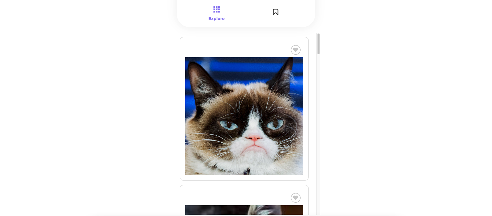
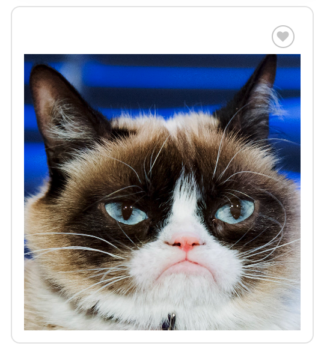

자! 이 글에 오신 당신이 프론트엔드 개발자를 꿈꾸면서 공부를 시작했으나 리액트부터 배운 커리큘럼으로 한계를 느낀 분이라면 잘 찾아오셨습니다.
우리는 자바스크립트만으로 간단한 앱을 구현해 볼 거에요.

1편은 "기본 기능 구현"입니다. HTML/CSS, 전반적인 세팅은 신경쓰지 마세요. 여러분은 오롯이 자바스크립트로 로직만 작성해주세요!

# 실습 준비
> [저장소 위치](https://github.com/FECrash/vanilla-catstagram/tree/60dc58e126fe52d9dd32b753d597ff8f9bb6559e)

## 실행 순서

```sh
# 1. 프로젝트 클론
git clone https://github.com/FECrash/vanilla-catstagram.git

# 2. 클론한 프로젝트로 이동
cd vanilla-catstragram

# 3. 프로젝트 브런치 변경
git checkout step-01

# 4. 의존성 설치
npm install

# 5. 실행
npm run dev
```

## 구동화면



## 구성
> 프로젝트 설정도 심플합니다. sass, vite 만 사용합니다.

앱을 킨 다음, 에디터로 돌아와 루트 경로의 `index.html`을 보면 아래의 코드가 반복되는 것을 알 수 있습니다.

```html
<div class="pin">
  <div class="button-wrapper">
    <div class="anim-icon anim-icon-md heart">
      <input type="checkbox" id="cat-02" />
      <label for="cat-02"></label>
    </div>
  </div>
  
</div>
```

눈치채신 분들이 많을거에요. 해당 앱은 public Cat API를 사용하여 **무한 스크롤(Infinite Scroll)** 을 구현합니다. 그럼 이렇게 반복되는 부분은 앱의 어느 영역일까요?



바로 여기죠. 즉 이 부분이 반복되는 부분으로 스크롤이 아래까지 내려가면 이미지 url을 fetch하여 동적으로 태그를 생성할 것입니다.

해당 앱은 로그인, 좋아요 등의 기능을 구현할 수 있는 HTML/CSS를 미리 만들어 두었기 때문에 욕심이 날 수 있으나 지금 당장은 무한 스크롤 앱을 구현하는 것에 집중하면 좋겠습니다.

## step 1 : 반복되는 DOM을 분리하기
상단에서 언급했던 `.pin` DOM을 볼까요? id와 label이 유니크하게 적혀 있고, img 태그의 src 부분을 교체할 수 있다면 동일한 성질의 다른 사진을 담은 카드를 여러 개 만들 수 있어보입니다. 일단 `index.html`에서 `.pin`을 모두 제거해보면 아래와 같이 남게 돼요.

```html
<main>
  <div class="container"></div>
  <div class="loader"></div>
</main>
```

자, 그러면 `.container`를 기억하고 해당 앱의 엔트리 파일인 `main.js`를 열어 로직을 수정해보겠습니다. public cat api의 주소는 **https://api.thecatapi.com/v1/images/search?size=full** 입니다. 상단의 주소를 브라우저에 입력하면 배열 안에 하나의 객체로 id와 url, width와 height를 반환하는 것을 알 수 있습니다.

사전에 10번 정도를 fetch한 뒤 해당 url을 주입하여 우리에게 친숙한 문자열 템플릿을 통해 고양이 카드들을 그려보도록 합시다.

- [**소스 보기**](https://github.com/FECrash/vanilla-catstagram/tree/step-02)

```js
const $container = document.querySelector('.container');

for (let i = 10; i > 0; i--) {
  const response = await fetch('https://api.thecatapi.com/v1/images/search?size=full');
  const data = await response.json();
  const { id, url } = data[0];
  
  const $pin = /* html */`
  <div class="pin">
    <div class="button-wrapper">
      <div class="anim-icon anim-icon-md heart">
        <input type="checkbox" id="cat-${id}" />
        <label for="cat-${id}"></label>
      </div>
    </div>
    
  </div>`;
  
  $container.insertAdjacentHTML('afterbegin', $pin);
}
```

> `insertAdjacentHTML` API가 생소하신 분들은 [**여기**](https://developer.mozilla.org/en-US/docs/Web/API/Element/insertAdjacentElement)를 참고해주세요.

간단한 코드죠? for-loop를 10번 돌고 각각의 루프마다 cat API를 콜하여 id, url을 가져옵니다. 그 후 문자열 템플릿으로 분리한 HTML에 id와 url을 입력해주면 끝입니다.

자, 여기까지 완성되신 분들은 `npm run dev` 명령어를 터미널에 친 후 결과물을 확인해 봅시다. 확실히 카드가 그려지는 것을 볼 수 있죠? 그런데 명확하게 문제점도 식별됩니다. 고양이 사진이 뭔가... 뭔가 느리게 불려지고 있어요. 스크롤이 다다닥 추가되지 않나요? 기능상으론 문제가 되지 않는 코드입니다. 그럼에도 사용자 관점에서는 부자연스럽고 이상하죠. 어떻게 해결하면 좋을까요?

저희는 이미 답을 알고 있을 것입니다. 방법은 무수히도 많죠. **로딩 스피너를 출력**하거나 **스켈레톤 이미지**를 적용하거나, **Vurtualize**를 이용하거나 **페이지네이션**을 적용하는 등 말이죠. 뭘 구현할지 걱정하지 마세요! 가장 고전적이면서도 효과적인, 로딩 스피너를 사용해볼 것입니다.

```html
<section class="loading hidden">
  <svg xmlns:svg="http://www.w3.org/2000/svg" xmlns="http://www.w3.org/2000/svg"
    xmlns:xlink="http://www.w3.org/1999/xlink" version="1.0" width="160px" height="20px" viewBox="0 0 128 16"
    xml:space="preserve">
    <path fill="#ffc1c4"
      d="M10,3.5C7.614-2.053.844-.758,0.8,5.681c-0.025,3.537,3.224,4.859,5.387,6.272A10.389,10.389,0,0,1,10.01,16c0.2-.782,1.863-2.711,3.8-4.084,2.123-1.5,5.412-2.736,5.387-6.272C19.156-.813,12.268-1.832,10,3.5Zm21.6,0c-2.382-5.548-9.152-4.254-9.2,2.186-0.025,3.537,3.224,4.859,5.387,6.272A10.389,10.389,0,0,1,31.61,16c0.2-.782,1.863-2.711,3.8-4.084,2.123-1.5,5.411-2.736,5.387-6.272C40.756-.813,33.868-1.832,31.6,3.5Zm21.6,0C50.814-2.053,44.044-.758,44,5.681c-0.025,3.537,3.224,4.859,5.387,6.272A10.389,10.389,0,0,1,53.21,16c0.2-.782,1.863-2.711,3.8-4.084,2.123-1.5,5.411-2.736,5.387-6.272C62.356-.813,55.468-1.832,53.2,3.5Zm21.6,0c-2.382-5.548-9.152-4.254-9.2,2.186-0.025,3.537,3.224,4.859,5.387,6.272A10.389,10.389,0,0,1,74.81,16c0.2-.782,1.863-2.711,3.8-4.084,2.123-1.5,5.412-2.736,5.387-6.272C83.956-.813,77.068-1.832,74.8,3.5Zm21.6,0c-2.382-5.548-9.152-4.254-9.2,2.186-0.025,3.537,3.224,4.859,5.387,6.272A10.389,10.389,0,0,1,96.41,16c0.2-.782,1.863-2.711,3.8-4.084,2.123-1.5,5.412-2.736,5.387-6.272C105.556-.813,98.668-1.832,96.4,3.5Zm21.6,0c-2.382-5.548-9.152-4.254-9.2,2.186-0.025,3.537,3.224,4.859,5.387,6.272A10.393,10.393,0,0,1,118.01,16c0.2-.782,1.863-2.711,3.8-4.084,2.123-1.5,5.412-2.736,5.387-6.272C127.156-.813,120.268-1.832,118,3.5Z" />
    <g>
      <path fill="#ff0713"
        d="M-11.6,3.5c-2.382-5.548-9.152-4.254-9.2,2.186-0.025,3.537,3.224,4.859,5.387,6.272A10.389,10.389,0,0,1-11.59,16c0.2-.782,1.863-2.711,3.8-4.084,2.123-1.5,5.412-2.736,5.387-6.272C-2.444-.813-9.332-1.832-11.6,3.5Z" />
      <path fill="#ff454e"
        d="M-33.2,3.5c-2.382-5.548-9.152-4.254-9.2,2.186-0.025,3.537,3.224,4.859,5.387,6.272A10.389,10.389,0,0,1-33.19,16c0.2-.782,1.863-2.711,3.8-4.084,2.123-1.5,5.412-2.736,5.387-6.272C-24.044-.813-30.932-1.832-33.2,3.5Z" />
      <path fill="#ff8389"
        d="M-54.8,3.5C-57.186-2.053-63.956-.758-64,5.681c-0.025,3.537,3.224,4.859,5.387,6.272A10.389,10.389,0,0,1-54.79,16c0.2-.782,1.863-2.711,3.8-4.084,2.123-1.5,5.411-2.736,5.387-6.272C-45.644-.813-52.532-1.832-54.8,3.5Z" />
      <animateTransform attributeName="transform" type="translate"
        values="22 0;43.5 0;65 0;86.5 0;108 0;129.5 0;151 0;172.5 0" calcMode="discrete" dur="900ms"
        repeatCount="indefinite" />
    </g>
  </svg>
</section>
```

이미 보셨겠지만, `index.html`에 로딩 영역을 미리 만들어 놓았습니다! 저희는 호출만 하면 돼요. 한 번 해볼까요? 저희는 비동기 통신을 **순차적으로** 호출하고 있기 때문에 단순히 `호출 시작하기 직전에 로딩 보여주고 호출 끝나면... 숨기면 되잖아?`로 귀결되지 않습니다.

이걸 `Promise.all`을 사용하여 해결해 봅시다.

- [**소스 보기**](https://github.com/FECrash/vanilla-catstagram/tree/step-03)

```js
const $container = document.querySelector('.container');
const $loading = document.querySelector('.loading');

const getCatImage = async () => {
  const response = await fetch('https://api.thecatapi.com/v1/images/search?size=full');
  const data = await response.json();
  return data[0];
}

const render = ({ id, url }) => {
  const $pin = /* html */`
  <div class="pin">
    <div class="button-wrapper">
      <div class="anim-icon anim-icon-md heart">
        <input type="checkbox" id="cat-${id}" />
        <label for="cat-${id}"></label>
      </div>
    </div>
    
  </div>`;

  $container.insertAdjacentHTML('afterbegin', $pin);
}

const results = [];
for (let i = 10; i > 0; i--) {
  results.push(getCatImage());
}

$loading.classList.toggle('hidden');

Promise.all(results)
  .then(cats => {
    cats.forEach(cat => render(cat));
  })
  .then(() => {
    $loading.classList.toggle('hidden');
  });
```

고양이 사진을 가져오는 함수인 `getCatImage`와 id, url을 입력받아 DOM에 그리는 `render` 함수를 만들었습니다. 나머지 코드는 거의 그대로지만, 모든 Promise가 `종료`되는 것을 기다리는 `Promise.all`을 통해 함수 호출-종료 시점을 제어할 수 있죠.

> `Promise.all`을 자세히 알고 싶다면 [**여기**](https://developer.mozilla.org/en-US/docs/Web/JavaScript/Reference/Global_Objects/Promise/all)를 참고해주세요.

따라서 렌더가 끝난 뒤, 프로미스 체이닝을 통해 로딩 스피너를 숨기는 것까지 완료되었습니다. 자! 이제 `npm run dev`를 콘솔에서 입력해주세요. 앱을 확인해보면 로딩 스피너가 정상적으로 동작하고, 고양이 이미지를 불러와 카드로 생성하는 작업이 끝나면 로딩 스피너가 없어지는 것을 볼 수 있습니다!

다음 글은 무한 스크롤을 추가하고 유틸성을 향상하는 작업을 진행하겠습니다.

다들 고생하셨어요! 👏
