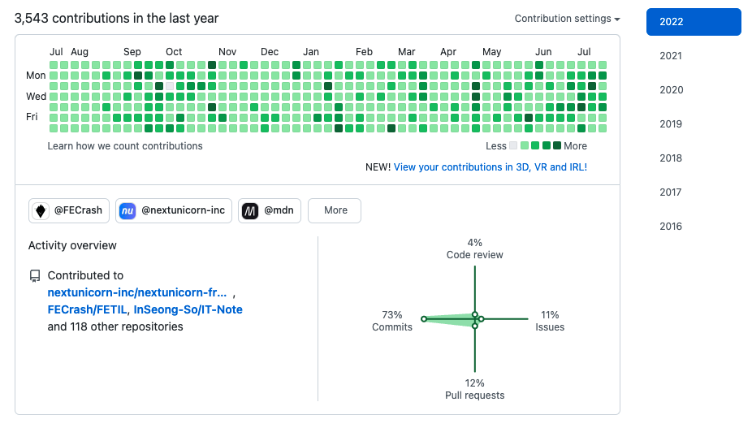
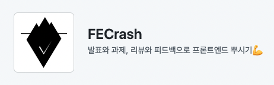
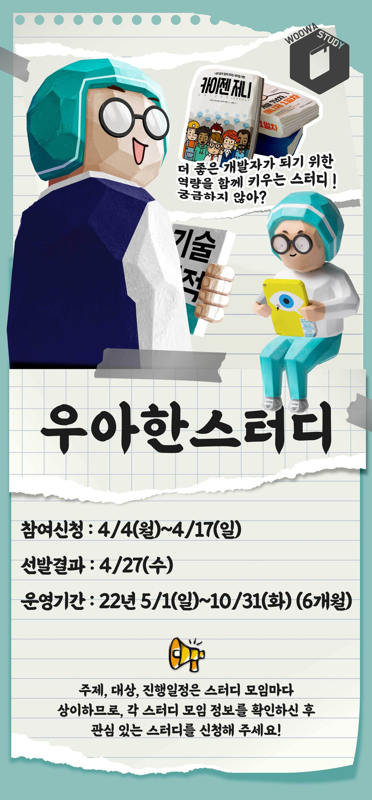
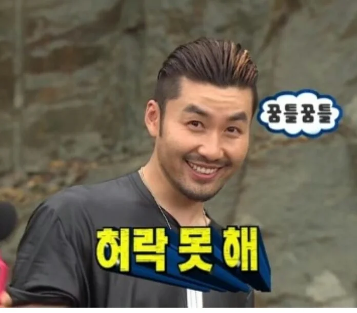
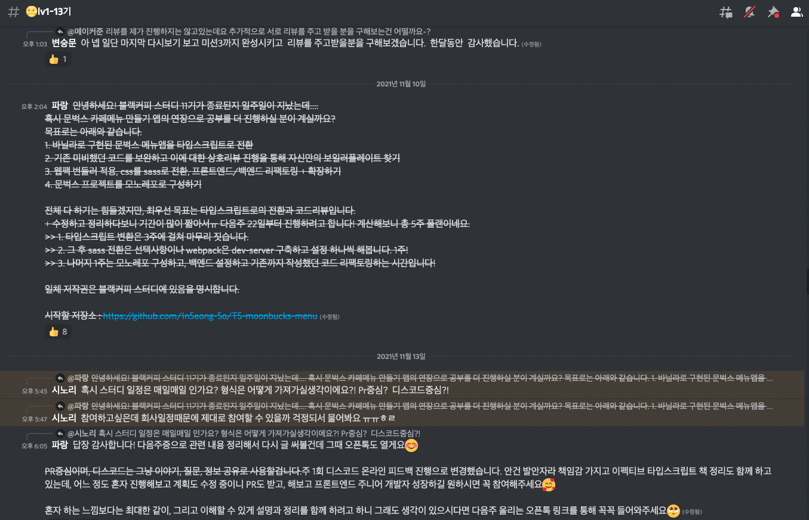

 

## 들어가며
전반기라고 하기엔 이미 7월이 다 가고 있네요🥲 글이 늦어지긴 했습니다. 변명을 하자면 너무 숨 가쁜 일상을 소화하고 있기 때문이에요...

초등학생 때부터도 시간이 빨리 간다고 불평했는데, 요즘은 그 속도가 공포 영화보다 무섭습니다. 빨리 감기를 하는 느낌이에요. 이런 불안은 주변의 정세나 뉴스에서의 안 좋은 소식으로 가중되는 것 같습니다.

군 간부 시절부터 삶에 대한 회고를 꾸준히 해 왔습니다. 온라인이 아니라 가슴팍에 들어가는 작은 포켓 수첩에 한 줄, 한 페이지씩 말이죠. 그 습관은 아직도 이어져 오는 것 같습니다. 덕분에 어떤 삶을 어떻게 살았고, 그 속에서 배운 것은 무엇이며 잘못한 건 뭔지 잘 생각해보게 되었죠. 이런 습관이 저의 고집으로, 아집으로 바뀌고 있는 것은 문제지만...

잡설이 길었는데, 달마다 무엇을 했는지 적어보려 합니다.

 

## 1. 2022년의 목표
> 그 전에, 저의 목표가 어떻게 달성되고 있는지 확인해봅니다.

### 운동하기
잘 지켜내고 있습니다! 취직하고 재택이 풀린 다음, 4월부터 진행하고 있네요.

- 월/수/금요일은 오전 헬스, 화/목요일에는 오전 수영, 점심 헬스.

클라이밍을 시작해서 달에 1 ~ 2회 정도 저녁에 가고 있습니다. 너무 재밌더라구요!

 

### 온라인으로 강의하기
좋은 기회로 코멘토에서 실무 PT를 진행하게 되었습니다. 좋아요, 아주 힘내고 있습니다!

점진적으로 양질의 강의를 만들려고 합니다. 다뤄보고 싶은 주제는 아래와 같아요.
  - ~~[x] 자바스크립트 기초 다지기~~ 진행 중
  - [ ] 바닐라 자바스크립트로 컴포넌트 만들기
  - [ ] 타입스크립트로 디자인 패턴 다이브하기
  - [ ] Next.js와 React-Query로 앱 만들기

 

### 스터디 확장하기

현재 운영 중인 [**FECrash**](https://github.com/FECrash)라는 Github Organization이 있습니다. 작년 9월부터 모던 자바스크립트 Deep Dive 스터디를 시작하면서 생성했던 저장소인데, 어느덧 23개의 레포를 보유하고 20명 가까운 인원이 족적을 남겨주었습니다.

하반기에는 온라인보다 오프라인 스터디로 확장하여 공유 오피스에서 평일/주말에 각 잡고 진행해보려 합니다. 많관부!

 

### 개발자 네트워킹

혼자 열심히 공부해서 성장할 수 있는 것에는 한계가 있습니다. 최대한 저를 주변에 알리고, 주변에서도 제게 도움을 청할 수 있는 상황을 만드는 게 이번 년도의 핵심 과제였습니다.

운 좋게도 우아한 스터디-HTTP 완벽 가이드 읽기에 참가하게 되어 많은 분들과 소통할 수 있게 되었습니다. 이런 계기를 기회 삼아 스터디와 함께 병행하여 꾸준히 모임의 장을 만들어 보고자 합니다. 1년, 3년, 5년 후에는 분명 이들이 대단한 위치에 서 있을 거라고 확신하니까요.

 

이렇게 적고 보니... 마음 먹은 것은 다 실행했네요. 이런 도전들이 발 담그기가 아니라 다이브까지 될 수 있게 노력해야겠죠. 열심히보다는 **잘**하는 것을 목표로 힘내야겠습니다.

 

## 2. 서비스 회사에 취직하기까지
> SI를 퇴사하고 8개월 만에 취직하게 되었습니다.

감개무량하네요. 필사적으로 공부했던 시기가 끝나고 업무를 하는 나 자신을 보면 `참 열심히 살고 있다`며 다독이게 됩니다.

### 2021년, SI를 퇴사한 뒤
면접이 운칠기삼(運七技三)이라지만 SI 퇴사 시기에 넣었던 100곳 이상의 기업은 서류조차 통과되지 않았습니다. 애당초 스타트 라인에 서지 못했었죠. 

서류는 무조건 붙을 거라는 근거 없는 자신감으로 어설프게 코딩 테스트를 준비했었기 때문에 2개월은 알고리즘만 팠습니다. 심지어 파이썬으로요... 운 좋게 합격한 모 회사의 코딩테스트 언어가 자바스크립트 only라는 것을 당일에서야 알고 멘탈이 크게 나갔던 기억이 있습니다. 그렇게 프론트엔드를 명확하게 공부해보자 마음 먹은 건 작년 9월부터였네요.

`var`, `==`만 써야했고 고차함수라는 단어조차 생소했던 제가 처음으로 자바스크립트 책을 사서 스터디원을 모집한 뒤 시작했죠. 남들에게 설명해주기 위해 조금 더 공부하고, 명료하게 정리하고, 시험 문제를 준비하고...

> 그 때 열심히 했던 저장소... [**JavaScriptCrash**](https://github.com/FECrash/JavaScriptCrash)

그러면서 MDN 페이지를 여러 개 번역해서 PR도 해보고, NEXTSTEP이라는 교육기관에서 진행한 바닐라 자바스크립트 스터디도 해보고, 타입스크립트의 ㅌ도 모르는 제가 구현했던 앱을 변환해보겠다고 또 스터디를 모집하고...

그렇게 네이티브만 끈질기게 공부했습니다. 우아한테크코스도 아쉽게 최종에서 떨어졌지만 과거의 자신과 비교했을 때 괄목할 성장을 하고 있음을 느꼈기에 금방 일어설 수 있었어요. 그렇게 12월까지의 공부만 하던 시기는 끝나고, 1월부터 본격적으로 지원하기 시작했습니다.

 

### 2022년, 취직까지
순수 자바스크립트, 타입스크립트만 4개월을 공부하고, 웹 프레임워크나 라이브러리를 모르는 상태로 여러 기업에 서류를 넣은들 저를 판단할 수 있는 수단은 많지 않을거라 생각했습니다. 다만 그 동안 공부를 어떻게 했는지 증빙할 수단은 많았어요. Github 저장소에 바닐라 자바스크립트로 짠 코드들, 타입스크립트로 디자인 패턴을 공부하고 적용하며 쌓인 고민들, 스터디를 진행하면서 배우고 리뷰했던 내용들.

과장하지 않고 코드로 말하자. 개발자는 말을 많이 해봐야 자신의 밑천만 드러난다는 생각으로 프로그래머스에 이력서를 정리한 뒤 무작정 지원하기 시작했습니다.

그런데... 어라? 10곳에 서류를 넣으면 9곳이 붙더군요!

이게 무슨 일이야... 물론 면접 자체를 많이 준비하지 않았기 때문에 최종까지 간 기업은 많지 않았습니다. 다만 이제야 프레임워크를 공부하고 어떻게 준비해야할 지 알게 되었죠. 단순히 이론을 외우는 게 아니라 실제로 적용하고 몸으로 경험해야 이해할 수 있구나, 를 너무 멀리 돌아오면서 알게 되었어요.

그 뒤는 사실 쉬웠다고 생각됩니다. `나를 증명할 수 있다. 나는 충분히 해낼 수 있는 사람이다.`를 보여주면 되었기 때문에, 초조함이나 불안함은 많이 옅어진 상태로 취업에 올인할 수 있었습니다.

운 좋게도 여러 기업에 합격하여 골라갈 수 있었고, 최종적으론 현재 몸 담고 있는 회사에 입사할 수 있었습니다.

 

## 2022년, 취직 이후
연봉도 SI에 비하면 많이 올랐고, 기업 문화는 비할 데가 아니었습니다. 또한 SI에서 경험했던 자존감 하락의 원인은 가스라이팅었다는 것도 깨달았죠. 많은 부분이 깨지기 시작했고 이 경험은 제게 너무나 긍정적이었습니다.

2월 14일, 첫 출근을 했습니다. 중국발 무역선이 출항하지 못해 맥북 M1을 곧바로 지급받지 못했고, 코로나 확진자 수가 폭증하여 16일부터 풀 재택근무로 돌입하게 되었어요. 사실 이 시기가 가장 애매했던 것 같습니다. `내가 뭘 하고 있는 거지? 뭘 할 수 있을까? 내 수준이 부족하진 않을까? 사람들은 날 알까?` 라는 오만가지 생각을 할 수 밖에 없는 상황이었으니까요. 신규 입사 후 온보딩이 제대로 이루어지지 않은 데다가 스프린트가 활발히 진행중이었기에 제가 맥락을 이해하는 데까진 시간이 소요되었습니다.

빠르게 다른 방향을 모색했습니다. 패키지를 분석하고, 어떤 기술이 핵심인지 파악하고, 여기서 내가 기여할 수 있는 부분은 무엇인지 확인하여 조금씩 작업하기 시작했습니다. 또한 재택 근무이기에 스터디를 많이 진행했는데, 이 때 **일주일에 6개**의 스터디를 소화했죠.

- 테오의 구글 스프린트 5기
- NEXTSTEP의 클린 코드 with 자바스크립트 2기
- 페어 프로그래밍
- 타입스크립트 앱 구현 스터디
- 타입스크립트 기초 스터디
- 프로그래머스 Node.js 스터디

3월 달에는 디자인 시스템을 분리하여 스토리북을 적용한 CDD로 전환하고, 4월부터는 CTO가 가진 개발팀 리더십 영역을 가져가기 시작했습니다. 태스크 매니징이나 애자일 프로세스의 체계를 조금 더 단단히 다지려고 했죠. 추가적으로 신규 프론트엔드 개발자 채용을 제가 맡기 시작했습니다. 채용 공고를 작성하는 것을 시작으로 면접 프로세스에 참여하고, 어느덧 면접 리더가 되어 있었죠. 여러 채용 플랫폼에 직접 인원들을 선별하여 서류를 검토하고, 기술 면접을 주도하고... 그렇게 수백명의 서류와 면접을 진행하게 되었습니다.

4월, 드디어 재택 근무가 종료되고 전 인원이 출근하면서 비로소 생기가 돈 개발 생활이 시작 되었습니다. 가장 큰 사건은 3년 전 React-Boilerplate로 작성된 레거시 코드를 두고, 새로운 저장소에서 새로운 feature들을 개발하자고 결정한 것이네요.

- npm workspace 기반의 monorepo
  - React
  - Redux
  - JavaScript
  - front-orm(자체 제작한 프레임워크)
  - styeld-components

위의 스택을 아래로 교체했습니다.

- yarn berry monorepo
  - Next.js with TypeScript
  - React-Query
  - emotion

또한 bitbucket 기반의 프로젝트 저장소를 Github으로 옮기는 과감한 도전이었죠. 이 과정에서 프로젝트 셋업, 개발환경 세팅, CI/CD 구축 등을 제가 담당하고 회의를 주도하기 시작하면서 프론트엔드 리더십이 제게 넘어왔습니다.

절대 쉽지 않은 일이었지만, 빠르고 힘들게 기술에 대한 공부와 이해를 때려 박았습니다. 이 시기를 넘기면 나는 성장할 것이고, 분명 다음 단계로 나아갈 수 있는 원동력을 키울 수 있으리라 확신했어요.

오피셜로 프론트엔드의 리더가 된 것은 6월이었습니다. 고작 2년 4개월짜리 SI 경력을 가진 개발자가 프론트엔드 개발자 9명을 리딩하게 되었죠. 팀원들이 저를 이해하고, 인정하게 만들기 위해 저의 의도와 행동 원리를 한 명, 한 명에게 직접 설명하고 그들의 반응을 읽었습니다. 또한 기술적으로 더 많은 걸 알기 위해 부단히 노력했죠. 무거운 직책이었지만, 스타트업이 가진 강점이자 약점인 `체계가 없는` 것을 해결하려면 팀원이 저를 진짜 리더로 신뢰할 수 있게 만들어야 했습니다.

스크럼을 정비하고, 수평 조직에서 필요 최저한의 보고나 규율을 추가하고, 문서화를 시작했습니다. 그 과정에서 스터디를 3개로 줄이고, 회의 및 멘토링에 시간을 더 많이 쓰게 되었죠. 저녁 식사가 끝난 후에야 온전히 개발을 진행할 수 있었습니다.

이렇게 24시간이 부족한 하루를 쌓다보니 어느덧 상반기가 끝나고, 저희의 새로운 서비스가 오픈하게 되었습니다. 바로 이틀 전에 배포를 끝마쳤거든요!

이렇게 쓰고보니 새삼.... 정말 열심히 살았네요😚

 

## 2022년, 앞으로는
업무적으로도 당면 과제는 무수히 많습니다. 제 개인적으로도 많죠.

올 한해는 프론트엔드 공부에 집중하려고 했습니다. 욕심이 많고, 신기술에도 관심이 많지만 눈 딱 감고 프론트엔드 기초만 깊게 파고 기반을 확실하게 다져 놓기로요. 남은 기간에는 네트워크, CSS, 자료구조, 자바스크립트/타입스크립트에 대해 딥 다이브할 겁니다. 그 이후에는 어떤 공부를 해도 괜찮을 것 같거든요.

다짐이 필요한 것 같진 않습니다. 그냥 지금처럼 꾸준히 살면... 빛을 보지 않을까요?🤗

아, 다짐이라기보단... 원대한 계획 중 하나인데, 개발자 커뮤니티를 브랜딩하고 싶습니다. 사전 작업으로는 스터디를 리딩해서 팀원이 이탈하지 않고 연락처까지 교환하는 것이겠죠. 그럼 제가 어설프게 아는 것이 아니라 그들의 가려운 곳도 시원하게 긁어줄 수 있을 정도로 명확하게 알고 있어야 합니다.

할 일이 너무나 많네요🙈

당장 8월부터 위워크라는 공용 오피스의 컨퍼런스 룸을 조금 더 적극적으로 활용할 생각입니다. 내/외부 스터디를 열어서 네트워킹을 겸한 시간을 꾸준히 갖는 방식으로요. 만약 이 글을 보고 괜찮다는 생각이 드신다면, 언제든 제게 메일을 보내주셔도 됩니다!😁

 

## 문제점, 가장 중요한 주제
이렇게까지만 쓰면 자화자찬과 무엇이 다를까요. 씁쓸하지만 당연히 문제들도 많았습니다.

1. 코멘토 실무 PT
   - 커리큘럼의 대상을 제대로 파악하지 못해 난이도 조절을 못한 점
   - 의욕이 앞서 수강생들의 상태를 인지하지 못한 점
   - 강의, 교안, 과제에 대한 퀄리티가 상대적으로 부족한 점

2. 실무에 욕심 부려서 개인의 일정을 소홀히 한 것
   - 과하게 업무를 하다보니 주말 출근이나 평일 야근을 당연하게 생각했던 부분
   - 개인적인 개발 공부를 손에 놓고 CI/CD를 수정해보거나, 현상을 해결하기 위해 개인 시간을 할애했던 부분
   - 앞으로는 회사 일에서 멀어져 자신의 공부와 여가 생활을 돌보면 어떨지

3. 리더 역량의 부족
   - 만약 내가 팀원이었다면 어땠을까
   - 솔선수범이 기본인데 과연 난 어떤가
   - 만약 전쟁 중이었다면, 팀원은 내게 등을 맡길 수 있을까

4. 오픈소스 만든다며...
   - 작년부터 기세등등하게 말했던 바닐라 오픈소스 만들기는 잠정 중단된 상태

5. 돈 버는 개발을 하지 못한 것
   - 지금 뭐하고 있는지 설명할 수 있어도, 이게 나의 커리에어 도움이 되는가
   - 최종적으로 내게 부족한 것은 어떤 배움을 통해 채우고 있는가

아찔하네요🥲 이런 부분을 개선하기 위해선... 회사 업무에서 멀어질 필요가 있겠네요. 열심히 보다는 잘, 제게 주어진 시간은 유한하니 선택과 집중을 통해 스스로의 삶을 돌봐야겠죠.

여기까지 저의 상반기 회고였습니다. 2022년 하반기 회고 때는 좀 더 기분 좋게 글을 쓸 수 있으면 좋겠네요!

 