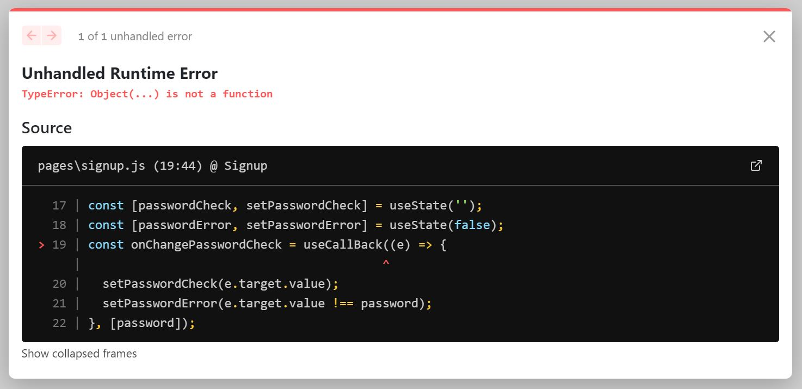

## `TypeError: Object(...) is not a function with "useCallBack"`

<div>



</div>

<br>

```js
import React, { useCallBack, useReducer } from "react";
```

`B`가 아니라 `b`입니다. `useCallback`이에요!

<br>

## WrappedApp created new store with withRedux(RootApp) { initialState: undefined, initialStateFromGSPorGSSR: undefined }

SSR 진행 간 브라우저가 state를 받지 못해 일으키는 메세지입니다.

reducer 설정을 확인해보세요! 분기 처리 된 `action`에 지정된 데이터가 없다면 초기화가 이루어지지 않아 null을 반환하게 됩니다.

<br>

## Unhandled Runtime Error
```
Error: Element type is invalid: expected a string (for built-in components) or a class/function (for composite components) but got: undefined. You likely forgot to export your component from the file it's defined in, or you might have mixed up default and named imports.

Check the render method of `CommentForm`.
```

오타를 확인해야 합니다. 친철하게 설명해주니 해당 파일을 찬찬히 살펴보세요. 위의 경우 `Input.TextArea`를 `Input.Textarea`로 입력해서 생겼습니다.
