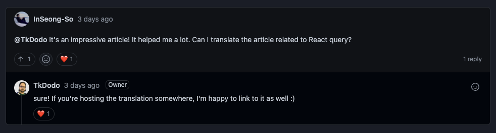

<div>



</div>

> Thanks for [@TkDodo](https://github.com/tkdodo)
>> 해당 컨텐츠는 [원글](https://tkdodo.eu/blog/effective-react-query-keys)을 번역한 것입니다. 오타, 오역 지적은 환영이에요!

<br>

# #8: Effective React Query Keys

[쿼리 키](https://react-query.tanstack.com/guides/query-keys)는 React Query에서 매우 중요한 개념입니다. 쿼리에 대한 종속성이 변경되면 라이브러리가 내부적으로 데이터를 올바르게 캐시하고 자동으로 다시 가져올 수 있도록 하기 위해 필요하죠. 마지막으로, 쿼리 캐시와 수동으로 상호 작용할 수 있습니다. 예를 들어 mutation 후 데이터를 업데이트하거나 일부 쿼리를 수동으로 무효화(invalidate)해야 하는 경우처럼 필요할 때처럼요.

이러한 작업을 보다 효과적으로 수행할 수 있도록 쿼리 키를 구성했던 개인적인 방법을 설명하기 전에 이 세 가지가 무엇을 의미하는지 간단히 살펴보겠습니다.

## **Caching Data**

내부적으로 쿼리 캐시는 단지 JavaScript 개체이자, 키는 직렬화된 쿼리 키, 값은 쿼리 데이터와 메타 정보입니다. 키는 [결정론적 방식](https://react-query.tanstack.com/guides/query-keys#query-keys-are-hashed-deterministically)으로 해시되므로 객체들도 사용할 수 있습니다(단, 최상위 수준에서는 키가 문자열 또는 배열이어야 합니다).

가장 중요한 부분은 쿼리 키가 고유해야 한다는 것입니다. React Query가 캐시에서 키에 대한 항목을 찾으면 그를 사용합니다. *useQuery*와 *useInfiniteQuery*에는 동일한 키를 사용할 수 없어요. 결국 쿼리 캐시는 하나뿐입니다. 그리고 이 둘 사이에 데이터를 공유하게 돼죠. 무한 쿼리(infinite queries)는 "일반" 쿼리와 근본적으로 다른 구조를 가지기 때문에 좋지 않습니다.

```tsx
useQuery(['todos'], fetchTodos)

// 🚨 this won't work
useInfiniteQuery(['todos'], fetchInfiniteTodos)

// ✅ choose something else instead
useInfiniteQuery(['infiniteTodos'], fetchInfiniteTodos)
```

## **Automatic Refetching**

> **쿼리는 선언형입니다.**
> 

이것은 아무리 강조해도 지나치지 않는 매우 중요한 개념이에요. 대부분의 사람들은 쿼리, 특히 refetching을 명령형으로 생각하는데, "클릭"하는 데도 시간이 걸릴 수 있습니다.

어떤 데이터를 fetch하는 쿼리가 하나 있습니다. 사용자는 버튼을 클릭하고 refetch가 되길 기대하지만 다른 매개 변수가 있어야 합니다. 저는 이런 시도를 많이 봐왔어요.

```tsx
function Component() {
  const { data, refetch } = useQuery(['todos'], fetchTodos)

  // ❓ how do I pass parameters to refetch ❓
  return <Filters onApply={() => refetch(???)} />
}
```

정답이 여기 있습니다. **이렇게 하지 않아도 돼요.**

refetch의 뜻은 그게 아니라, 동일한 매개 변수를 사용하여 refetching을 하는 것입니다.

데이터를 변경하는 상태가 있는 경우 키가 변경될 때마다 refetch가 자동으로 트리거되므로 쿼리 키에 데이터를 넣기만 하면 됩니다. 따라서 필터를 적용하려는 경우 클라이언트 상태를 변경하기만 하면 됩니다.

```tsx
function Component() {
  const [filters, setFilters] = React.useState()
  const { data } = useQuery(['todos', filters], () => fetchTodos(filters))

  // ✅ set local state and let it "drive" the query
  return <Filters onApply={setFilters} />
}
```

*setFilters* 업데이트에 의해 트리거된 re-render에서 다른 쿼리 키를 React Query에 전달하여 다시 가져옵니다. 예제는 [#1: Practical React Query - Treat the query key like a dependency array](https://tkdodo.eu/blog/practical-react-query#treat-the-query-key-like-a-dependency-array)를 확인해주세요.

## **Manual Interaction**

쿼리 캐시와의 수동적 상호 작용은 쿼리 키의 구조가 가장 중요한 부분입니다. [invalidateQueries](https://react-query.tanstack.com/reference/QueryClient#queryclientinvalidatequeries) 또는 [setQueriesData](https://react-query.tanstack.com/reference/QueryClient#queryclientsetqueriesdata)와 같은 많은 상호 작용 메서드로 쿼리 키를 얕게 일치시킬 수 있는 [Query Filters](https://react-query.tanstack.com/guides/filters#query-filters)를 지원합니다.

## **Effective React Query Keys**

이러한 점들은 (사실 이 블로그의 모든 것과 마찬가지로) 제 개인적인 의견을 반영하므로, 쿼리 키 작업을 할 때 반드시 해야 하는 게 아닙니다. 저는 이러한 전략들이 앱의 복잡성이 증가할 때 가장 잘 동작하고 잘 확장된다는 것을 발견했습니다. 간단한 앱에서는 이런 작업을 수행할 필요가 없어요😁

## **Colocate**

만약 당신이 아직 [Kent C. Dodds](https://twitter.com/kentcdodds)의 [Colocation을 통한 Maintenability](https://kentcdodds.com/blog/colocation)를 읽지 않았다면 꼭 보세요. 모든 쿼리 키를 /src/utils/queryKeys.ts에 글로벌하게 저장한다고 상황이 개선되지는 않을 것입니다. 기능 디렉터리에 있는 해당 쿼리 옆에 쿼리 키를 보관해보면 어떨까요?

```tsx
- src
  - features
    - Profile
      - index.tsx
      - queries.ts
    - Todos
      - index.tsx
      - queries.ts
```

쿼리 파일에는 React Query와 관련된 모든 내용이 포함됩니다. 저는 보통 Custom Hook만 내보내므로 실제 쿼리 기능뿐만 아니라 쿼리 키도 지역적으로 유지됩니다.

## **Always use Array Keys**

쿼리 키도 문자열이 될 수 있지만, 통일성을 유지하기 위해 항상 배열을 사용해주세요. React Query는 내부적으로 문자열을 배열로 변환합니다.

```tsx
// 🚨 will be transformed to ['todos'] anyhow
useQuery('todos')
// ✅
useQuery(['todos'])
```

React Query v4에서는 모든 키가 배열이여야 합니다.

## **Structure**

쿼리 키를 가장 일반적인 것부터 세부적인 것까지, 해당 수준을 구체화하여 구성합니다. 필터링 가능한 목록과 세부 보기를 허용하는 todos list를 구성하는 방법은 다음과 같습니다.

```tsx
['todos', 'list', { filters: 'all' }]
['todos', 'list', { filters: 'done' }]
['todos', 'detail', 1]
['todos', 'detail', 2]
```

이 구조를 사용하면 모든 todos, list, detail 정보를 ['todos']의 관계에서 제외할 수 있을 뿐만 아니라 정확한 키를 알면 하나의 특정 목록을 대상으로 지정할 수 있습니다. 필요한 경우 모든 목록을 대상으로 지정할 수 있으므로 [Mutation Response의 업데이트](https://react-query.tanstack.com/guides/updates-from-mutation-responses)는 훨씬 더 유연해집니다.

```tsx
function useUpdateTitle() {
  return useMutation(updateTitle, {
    onSuccess: (newTodo) => {
      // ✅ update the todo detail
      queryClient.setQueryData(['todos', 'detail', newTodo.id], newTodo)

      // ✅ update all the lists that contain this todo
      queryClient.setQueriesData(['todos', 'list'], (previous) =>
        previous.map((todo) => (todo.id === newTodo.id ? newtodo : todo))
      )
    },
  })
}
```

list와 detail의 구조가 많이 다르면 이 기능이 작동하지 않을 수 있으니 이를 대신해 모든 list를 무효화할 수 있습니다.

```tsx
function useUpdateTitle() {
  return useMutation(updateTitle, {
    onSuccess: (newTodo) => {
      queryClient.setQueryData(['todos', 'detail', newTodo.id], newTodo)

      // ✅ just invalidate all the lists
      queryClient.invalidateQueries(['todos', 'list'])
    },
  })
}
```

예를 들어 url에서 필터를 읽어 현재 어떤 목록에 있는지 알고 있으므로 정확한 쿼리 키를 구성할 수 있다면, 이 두 가지 방법을 결합하여 list에서 *setQueryData*를 호출하고 다른 모든 것을 무효화할 수도 있습니다.

```tsx
function useUpdateTitle() {
  // imagine a custom hook that returns the current filters,
  // stored in the url
  const { filters } = useFilterParams()

  return useMutation(updateTitle, {
    onSuccess: (newTodo) => {
      queryClient.setQueryData(['todos', 'detail', newTodo.id], newTodo)

      // ✅ update the list we are currently on instantly
      queryClient.setQueryData(['todos', 'list', { filters }], (previous) =>
        previous.map((todo) => (todo.id === newTodo.id ? newtodo : todo))
      )

      // 🥳 invalidate all the lists, but don't refetch the active one
      queryClient.invalidateQueries({
        queryKey: ['todos', 'list'],
        refetchActive: false,
      })
    },
  })
}
```

v4에서 *refetchActive*가 *refetchType*으로 대체되었습니다. 위의 예제에서 refetchType: 'none’를 선언했는데, 아무것도 다시 검색하지 않으려는 의미입니다.

## **Use Query Key factories**

위의 예제에서는 직접 쿼리 키를 선언했음을 알 수 있습니다. 이는 오류가 발생하기 쉬울 뿐만 아니라 키에 다른 수준의 세분화를 추가하려는 경우처럼 향후 변경 작업을 더욱 어렵게 만듭니다.

그것이 내가 함수당 하나의 Query Key factory를 추천하는 이유입니다. 오직 entries and functions이 있는 간단한 객체일 뿐이며 쿼리 키를 생성하고, 이를 Custom Hook에서 사용할 수 있기 때문이죠. 위의 예제 구조를 바꾼다면 다음과 같습니다.

```tsx
const todoKeys = {
  all: ['todos'] as const,
  lists: () => [...todoKeys.all, 'list'] as const,
  list: (filters: string) => [...todoKeys.lists(), { filters }] as const,
  details: () => [...todoKeys.all, 'detail'] as const,
  detail: (id: number) => [...todoKeys.details(), id] as const,
}
```

따라서 각 레벨은 다른 레벨 위에 구축되지만 독립적으로 액세스할 수 있으므로 유연성이 뛰어납니다.

```tsx
// 🕺 remove everything related to the todos feature
queryClient.removeQueries(todoKeys.all)

// 🚀 invalidate all the lists
queryClient.invalidateQueries(todoKeys.lists())

// 🙌 prefetch a single todo
queryClient.prefetchQueries(todoKeys.detail(id), () => fetchTodo(id))
```