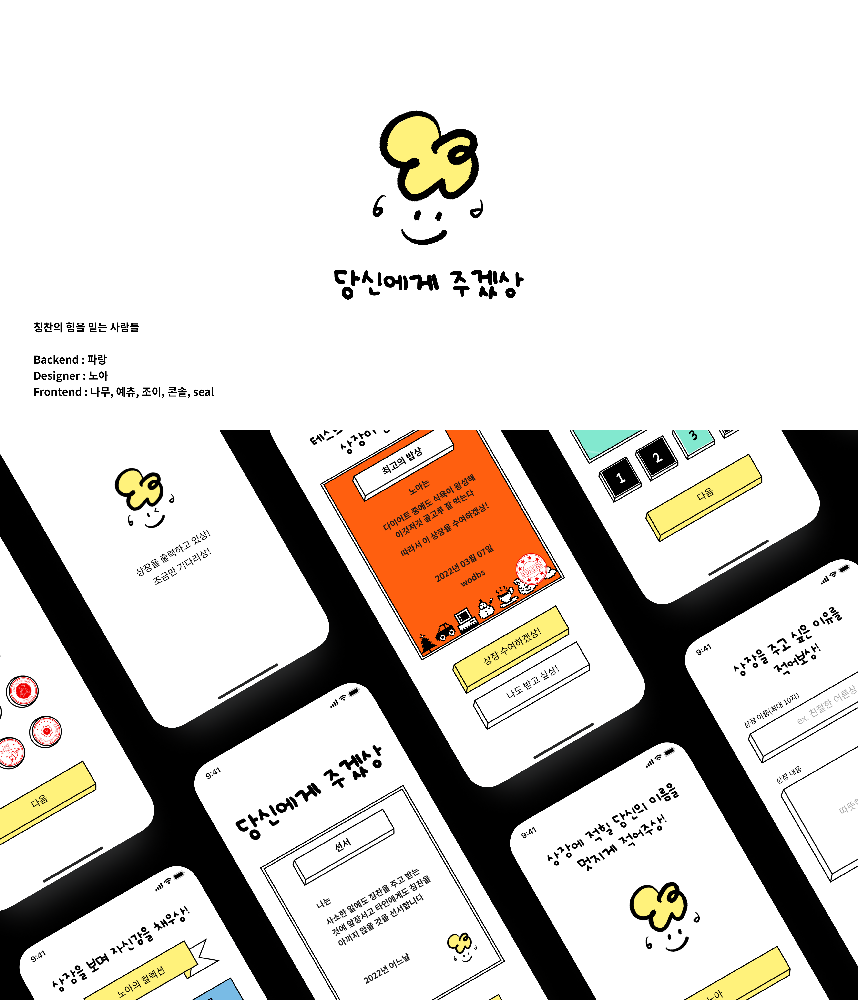

 

## 들어가며
`성장`이란 무엇일까요? 분명 공부하고 코드를 작성하면서 많은 시간을 보냄에도 이 `성장`이라는 녀석은 도통 알기가 힘들어요. 내가 얼만큼 와있는지, 어느 정도인지, 역량은 어느 수준인지... 명확하게 눈에 보이는 지표가 없기 때문에 하늘을 바라보는 느낌만 듭니다. 초조함은 커지면서 과연 잘하고 있는 걸까, 하는...

그런 참에 시니어 프론트엔드 개발자 테오의 오픈 톡방에 들어가면서 기회를 얻게 되었습니다. 구글 스프린트 5기! 눈 여겨보던 토이 프로젝트라서 바로 참가를 하게 되었네요.

말 그대로 불꽃 튀는 5일이었습니다. 소중한 팀원들과 하나의 `완결 조건`을 향해 달린 결과, [**당신에게 주겠상🏆**](https://serene-golick-21e934.netlify.app/)이 탄생했습니다!

꼭 무슨 감정으로 시작하고 어떻게 끝맺었는지 기록하기 위해 회고를 씁니다.

 

## 스프린트에 지원하게 된 동기
단기간에 빠른 성장을 할 수 있다는 것이 핵심이었습니다. 짧은 스프린터를 통해 다양한 환경의 개발자, 디자이너와 협업을 할 수 있었고 흡사 해커톤 같은 느낌이기에 엄청난 몰입이 필요했죠.

매 회고 글을 보며 좀 부러워했습니다. 서비스를 만드는 행위 자체는 혼자서도, 또는 제가 직접 리드할 수 있었지만 그 품질에는 자신이 없었으며 `그래서 내가 무엇을 얻었고 이로 인해 성장할 수 있었는가`에 대답할 수 없었기 때문이죠.

상대방에 대한 이해를 쌓으면서 어떤 데모를 만들어낼지, 의견을 공유하고 공감하며 가끔은 토론도 할 수 있는 협업 환경은 **경험이 많은 구심점 역할을 할 수 있는 시니어**가 없다면 쉽게 구성되지 않더라구요. 따라서 테오가 운영하는 이 스프린트에 꼭 참가해서 이러한 분위기를 느끼고 제가 이어갈 수 있으면 좋겠다는 생각을 했습니다.

아주 아슬아슬하게 마지막 버스에 탑승했죠! 그렇게 수요일 저녁 11시, 첫 스프린트가 열렸습니다.

 

## 진행
> 모든 진행은 피그잼과 게더 타운으로 진행됐어요🤗

 

### 1일차 - 첫 만남

 

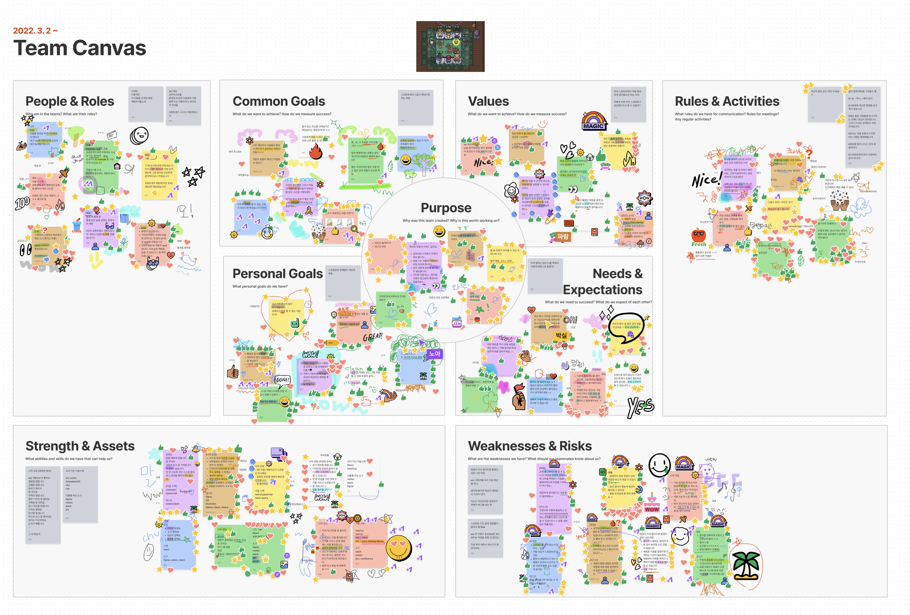

 

서먹한 처음을 이겨내고 모두 활발하게 스티커를 붙이며 시작했습니다! `자기소개`를 하고 어떤 `아이디어`를 채택할지 많이 이야기했어요.

 

### 2일차 - 서비스 구체화

 

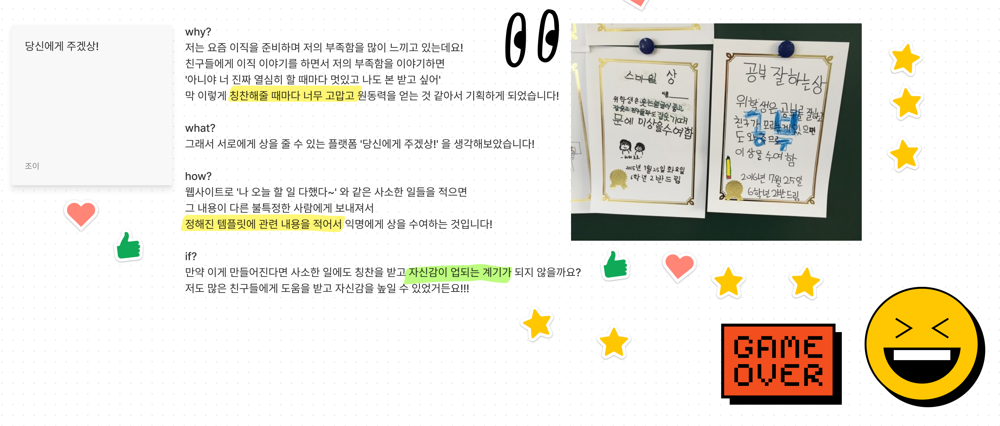

 

도출된 아이디어로 `어떤 서비스를 만들지`를 이야기했습니다. 그 과정이 매우 인상 깊었는데, 아래와 같았습니다.

- **궁극적인 목적**: 서비스를 사용한 대상은 어떤 상태일까?
  - 서비스의 존재 이유는 무엇이 되어야 할까?
  
  - 서비스의 대상은 어떻게 될까?
  
  - 어떻게 하면 요망하는 상태를 만들 수 있을까?

 

- **비판적인 시선**: 서비스를 만들면서, 혹은 완성하면서 생길 문제는 무엇일까?
  - 현실적으로 실현이 가능할까?
  
  - 의도와 목적은 맞을까?

 

세부적으로 항목을 쪼개어 고민하면서 팀원들이 공통적으로 사용했던 단어(word), 목표(goal)와 중요하다고 생각되는 점(point)들을 모아 단어 그룹으로 정리하며 최대한 시각화하고 서비스의 방향을 하나로 모으기 위해 노력한 단계 같았어요.

 

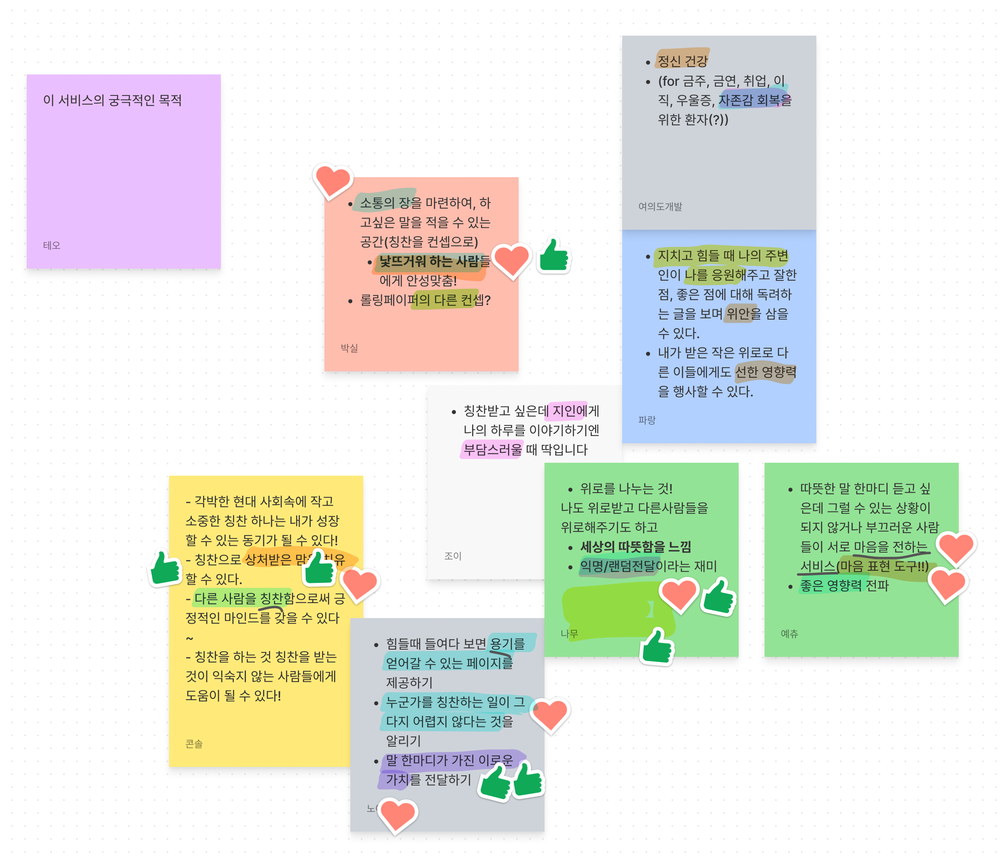

 

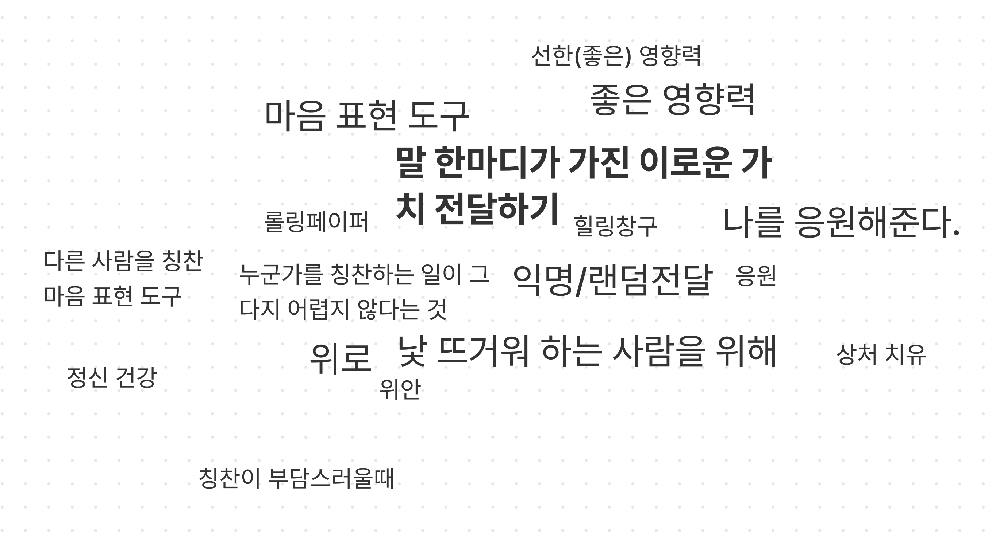

 

모두 이미지로 첨부하진 못하지만 위의 과정을 하나씩 진행했습니다. 결과적으로 아주 좋은 방법이었어요😆! 팀원들의 목표를 위한 여정이 구체화되기 시작했거든요.

이를 토대로 로드맵을 그리고, 스케치를 위한 항목을 다시 뽑아내어 정리했습니다.

 

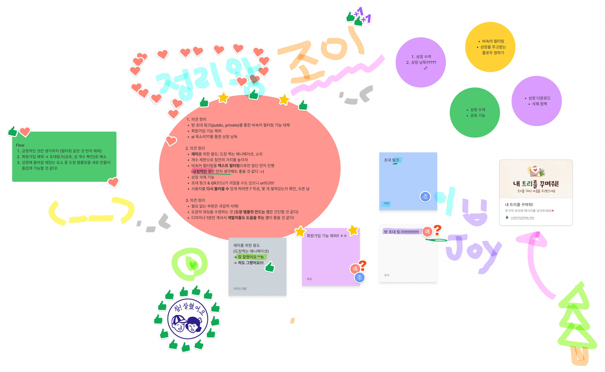

 

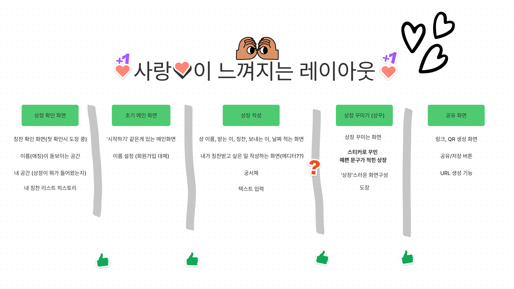

 

### 3일차 - 프로젝트 스케치, PL 선정과 BDD

 

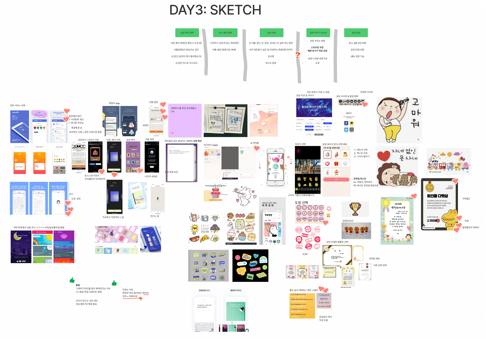

 

21세기 시대입니다. 우리가 생각한 아이디어는 분명 누군가도 생각했고, 또 더 많은 발전을 통해 서비스로 존재할 수 있었습니다. 그에 따른 레퍼런스를 찾고 우리의 서비스에 도움이 되는 자료들을 찾아 정리하는 시간이었어요.

레퍼런스를 정리하고 프로젝트 스케치를 진행했으며 어떤 레이아웃과 페이지를 구성하고 디자인은 어떻게 가져갈치 프로토타이핑을 했는데, 서비스가 탄생하는 `기획` 과정을 실시간으로 진행하는 것이 너무나 좋았습니다.

 

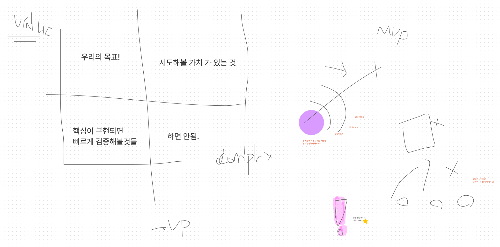

 

그 후 현질적인 목표를 선정하고 `MVP(Mninimum Viable Product, 최소 기능 제품)`를 이루기 위해 많은 노력을 기울였습니다. **개발을 80프로 진행한 것은 미완성**입니다. 따라서 핵심에 집중하여 배포 가능한 상태를 최우선적으로, 그 뒤에 개선과 확장을 하자는 것이었죠.

 

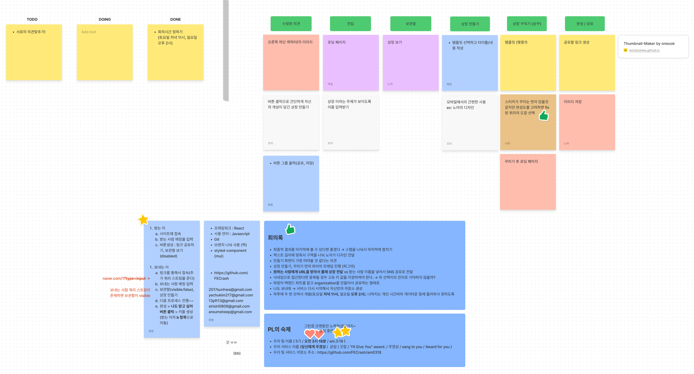

 

협업이 생소했던 우리에게 테오는 마지막으로 `BDD(Behavior Driven Development)`를 언급하며 온전히 저희의 시간을 만들어주었습니다.
- 최대한 Task를 잘게 쪼개야 합니다.
  - 단, 사용자의 행동 관점(단위)으로 Task를 분리하는 것입니다.
  - 이로써 놓치는 것을 최소화하고 협업을 통해 기능을 완성하기 수월해집니다.

 

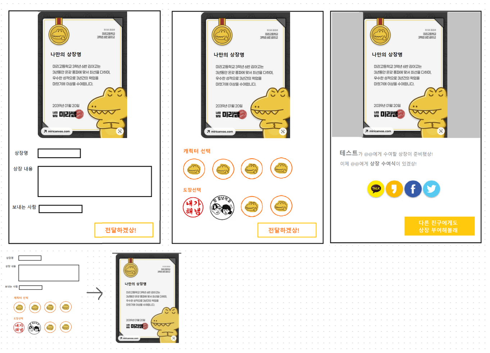

 

그렇게 새벽내내 given, when, then을 통해 도출하여 레이아웃 별로 정의하고, API와 기능을 연결하면서 탄생한 프로세스는 저희의 프로젝트 방향에 많은 도움이 되었습니다.

특히 이 날이 가장 의미있었던 부분은 `팀원의 의사결정을 명확하게 할 수 있었던 점`, `익명성이냐 편의성이냐를 정의했던 점`, `서비스 스펙을 도출한 기능에 맞게 가져갔던 점`이 되겠네요! 이 시간은 다시 한 번 느끼고 싶을 정도로 강렬하고 인상 깊었습니다. 앞으로의 개발 방향에 영향을 미칠 정도로요😇

 

### 4일차, 5일차 - 프로젝트 구현
토요일 내내, 일요일 내내 개발을 진행했습니다. 저는 일요일 일정에 불참했지만 다른 팀원들이 너무나 열심히 진행해준 덕에 서비스가 하나씩 틀을 잡더니 금방 완성이 된 느낌이었습니다!

한 명의 디자이너, 6명의 프론트엔드 개발자로 이루어진 팀이었습니다. 정의된 프로젝트 기능에 따라 백엔드가 필요했고, 제가 간단한 REST API 서버를 만들기 위해 MonoRepo로 저장소를 구축하여 팀원들에게 공유했습니다. 그 뒤 지체 없이 개발이 시작되었는데, 2명씩 페어를 맺어 레이아웃, API, 컴포넌트, 서비스 로직을 구분하여 `페어 프로그래밍`을 진행했습니다.

> 백엔드와 서비스 배포를 진행한다고 프론트엔드 개발에 많이 미흡했습니다. 저의 페어가 다른 페어 사이에 껴서 개발하는 것이 마음에 아프더군요...😭

커밋 내역과 기여를 보고 싶다면 [**새벽 3시 18분 저장소**](https://github.com/FECrash/am0318)에 방문해주세요🤗

 

## 마무리하며
### 결과
그렇게 일요일의 새벽이 지나고 월요일, 서비스 배포까지 완료되어 테오가 사용을 해보더군요! 너무 떨리던 순간이었지만 큰 문제 없이 기능이 동작되어 요망하던 궁극적인 목표, `칭찬을 통해 격려와 위로하기`를 달성할 수 있었습니다. 고생해준 팀원들 너무 고마웠어요.

우리 새벽 3시 18분의 [**당신에게 주겠상🏆**](https://serene-golick-21e934.netlify.app/)을 꼭 써주세요🥰 쌓인 상장을 보면 너무 행복하답니다❤

 

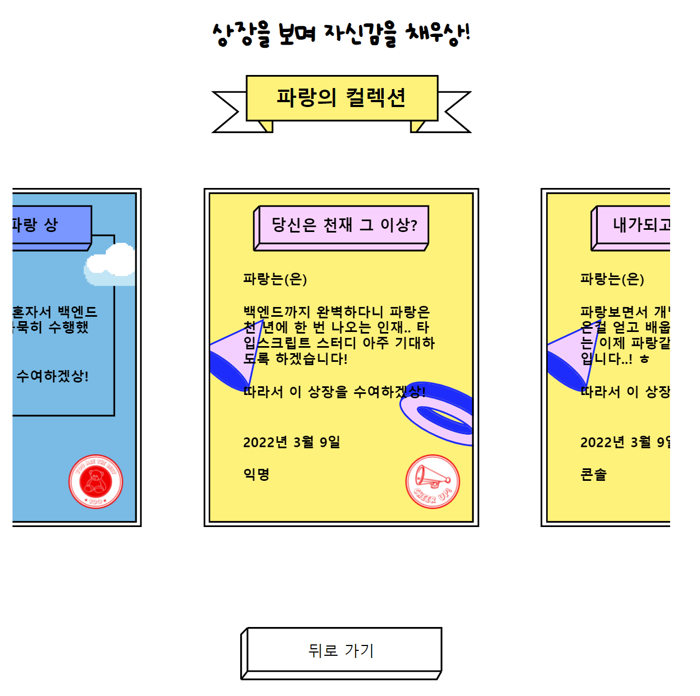

 

### 아쉬운 점
1. 서비스 배포에 대한 명확한 DevOps 개념이 없다는 것
2. NestJS를 제대로 다루지 못해 Node-Express로 개발한 점
3. 요금제가 없어서인지 무료 호스팅 서비스로는 속도가 느리단 점
4. 더 명확하게 팀원과 의사결정 했으면 완성도가 높았을 것 같은 점...

 

> 프로젝트 저장소 : [am0318](https://github.com/FECrash/am0318)

> 서비스 바로가기 : [당신에게 주겠상🏆](https://serene-golick-21e934.netlify.app/)